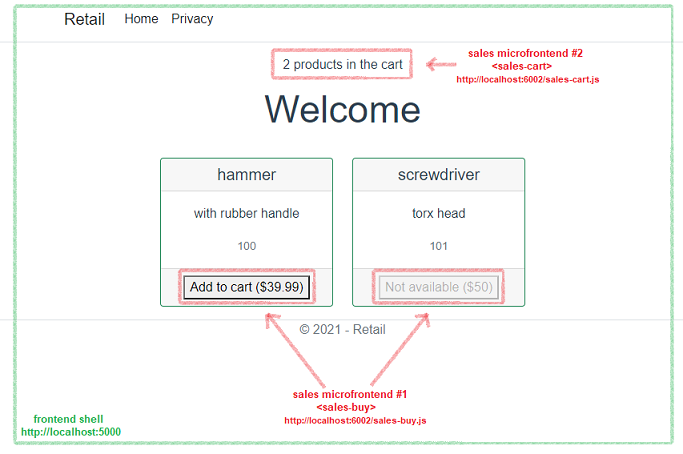

# Retail SOA
Ordinary online retail service with service oriented architecture.  
At some point it may evolve into coarse-grained microservices architecture.
## Services
### Retail.Queue
RabbitMQ with custom configuration. Transport for MassTransit service bus.
### Retail.Frontend
SPA in Vue.js 2. Combines multiple microfrontends into a single UI for the application.  
 
### Retail.Sales
ASP.NET Core Web API with MassTransit. Uses saga to process order in each state.
### Retail.Sales.Microfrontend
WebComponents in vanilla JavaScript, served with nginx. Provides fragments for other views.  
- `<sales-buy>` - displays "buy button" for product with given ID, emits `product_added_to_cart` event
- `<sales-cart>` - displays cart count, consumes `product_added_to_cart` to update state
### Retail.Billing
MassTransit console app. Collects payment for the orders. Uses key-value store to keep state.
### Retail.Billing.Database [TODO]
Redis key-value store.
### Retail.Shipping
MassTransit console app. Ships order products to the customer. Manages state in NoSQL database.
### Retail.Shipping.Database [TODO]
MongoDB NoSQL database.
### Retail.Catalog
ASP.NET Core Web API. Simple CRUD for products information. Uses Dapper with relational database.
### Retail.Catalog.Database
PostgreSQL relational database.
### Retail.Catalog.Frontend
Svelte UI for product catalog CRUD operations.
### Retail.Recommendations [TODO]
MassTransit console app. Implements "You may also like" feature for products with graph database.
### Retail.Recommendations.Database
Neo4j graph database.
### Retail.Search [TODO]
ELK stack. Provides full-text search for various services.
### Retail.Auth
IdentityServer4. Handles authentication and authorization with RSA256 signed JWT.  
RSA is preffered over HMAC, as such tokens can be verified by other services which cached Auth's public key.
### Retail.Http
Example HTTP requests to various services.
